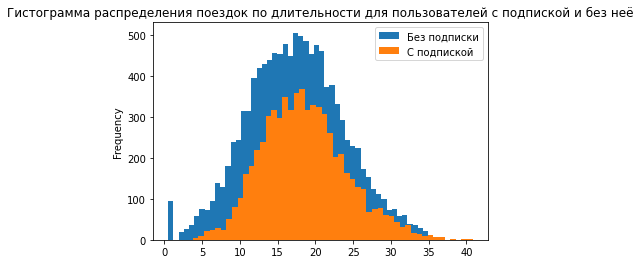

#### Введение

В рамках выполнения данной работы предстоит изучить выборку из базы данных сервиса проката самокатов. Даны следующие таблицы:

* *users_go.csv* - с информацией о пользователях
* *rides_go.csv* - с информацией о каждой поездке
* *subscriptions_go* - с информацией о типах подписок

**Должны быть выполнены следующие задачи:**

1. На этапе предобработки должна быть проверена выборка (на наличие явных и неявных дубликатов), изменены типы данных столбцов, там, где это требуется

2. Должно быть проанализировано распределение данных в выборке по след. параметрам:

* Город пользователя
* Наличие подписки
* Возраст пользователя
* Продолжительность поездки
* Преодолённое в рамках поездки расстояние

3. Должна быть составлена объединенная таблица, содержащая все имеющиеся параметры. Также требуется составить отдельную таблицу для пользователей с подпиской и без нее и сравнить распределения параметров у каждого из 2 типов пользователей по подписке

4. Должна быть составлена таблица с подсчётом ежемесячной выручки с каждого человека, требуется провести сравнение средней выручки от платных и бесплатных пользователей

5. Требуется проверить следующие гипотезы:

* Пользователи с подпиской тратят больше времени на поездки

* Среднее расстояние, которое проезжают пользователи с подпиской за одну поездку, не превышает 3130 метров

* Помесячная выручка от пользователей с подпиской по месяцам выше, чем выручка от пользователей без подписки

6. Получены ответы на вопросы следующих двух задач и построены соответствующие распределения:

* Требуется привлечь 100 новых платных клиентов. Сколько требуется разослать промокодов, чтобы достичь требуемого результат с веротностью около 95% при условии, что после пробного периода подписку продлевает около 10% пользователей?

* Планируется разослать 1 млн уведомлений. Зная, что около 40% пользователей открывают уведомления, найти вероятность того, что уведомления будут открыты не более 399.5 тысяч раз.


```python
import warnings
import pandas as pd
import numpy as np
from scipy import stats as st
import matplotlib.pyplot as plt
from math import factorial, sqrt

warnings.filterwarnings('ignore')
```

#### Шаг 1. Загрузка данных


```python
users = pd.read_csv('/datasets/users_go.csv')#таблица с информацией о пользователях
rides = pd.read_csv('/datasets/rides_go.csv')#таблица с информацией о поездках
subs = pd.read_csv('/datasets/subscriptions_go.csv')#таблица с информацией о типах подписок
```


```python
def show_data(data):
    display(data.head())
    display(data.info())
show_data(users)
```


<div>
<style scoped>
    .dataframe tbody tr th:only-of-type {
        vertical-align: middle;
    }

    .dataframe tbody tr th {
        vertical-align: top;
    }

    .dataframe thead th {
        text-align: right;
    }
</style>
<table border="1" class="dataframe">
  <thead>
    <tr style="text-align: right;">
      <th></th>
      <th>user_id</th>
      <th>name</th>
      <th>age</th>
      <th>city</th>
      <th>subscription_type</th>
    </tr>
  </thead>
  <tbody>
    <tr>
      <th>0</th>
      <td>1</td>
      <td>Кира</td>
      <td>22</td>
      <td>Тюмень</td>
      <td>ultra</td>
    </tr>
    <tr>
      <th>1</th>
      <td>2</td>
      <td>Станислав</td>
      <td>31</td>
      <td>Омск</td>
      <td>ultra</td>
    </tr>
    <tr>
      <th>2</th>
      <td>3</td>
      <td>Алексей</td>
      <td>20</td>
      <td>Москва</td>
      <td>ultra</td>
    </tr>
    <tr>
      <th>3</th>
      <td>4</td>
      <td>Константин</td>
      <td>26</td>
      <td>Ростов-на-Дону</td>
      <td>ultra</td>
    </tr>
    <tr>
      <th>4</th>
      <td>5</td>
      <td>Адель</td>
      <td>28</td>
      <td>Омск</td>
      <td>ultra</td>
    </tr>
  </tbody>
</table>
</div>


    <class 'pandas.core.frame.DataFrame'>
    RangeIndex: 1565 entries, 0 to 1564
    Data columns (total 5 columns):
     #   Column             Non-Null Count  Dtype 
    ---  ------             --------------  ----- 
     0   user_id            1565 non-null   int64 
     1   name               1565 non-null   object
     2   age                1565 non-null   int64 
     3   city               1565 non-null   object
     4   subscription_type  1565 non-null   object
    dtypes: int64(2), object(3)
    memory usage: 61.3+ KB


    None


```python
show_data(rides)
```


<div>
<style scoped>
    .dataframe tbody tr th:only-of-type {
        vertical-align: middle;
    }

    .dataframe tbody tr th {
        vertical-align: top;
    }

    .dataframe thead th {
        text-align: right;
    }
</style>
<table border="1" class="dataframe">
  <thead>
    <tr style="text-align: right;">
      <th></th>
      <th>user_id</th>
      <th>distance</th>
      <th>duration</th>
      <th>date</th>
    </tr>
  </thead>
  <tbody>
    <tr>
      <th>0</th>
      <td>1</td>
      <td>4409.919140</td>
      <td>25.599769</td>
      <td>2021-01-01</td>
    </tr>
    <tr>
      <th>1</th>
      <td>1</td>
      <td>2617.592153</td>
      <td>15.816871</td>
      <td>2021-01-18</td>
    </tr>
    <tr>
      <th>2</th>
      <td>1</td>
      <td>754.159807</td>
      <td>6.232113</td>
      <td>2021-04-20</td>
    </tr>
    <tr>
      <th>3</th>
      <td>1</td>
      <td>2694.783254</td>
      <td>18.511000</td>
      <td>2021-08-11</td>
    </tr>
    <tr>
      <th>4</th>
      <td>1</td>
      <td>4028.687306</td>
      <td>26.265803</td>
      <td>2021-08-28</td>
    </tr>
  </tbody>
</table>
</div>


    <class 'pandas.core.frame.DataFrame'>
    RangeIndex: 18068 entries, 0 to 18067
    Data columns (total 4 columns):
     #   Column    Non-Null Count  Dtype  
    ---  ------    --------------  -----  
     0   user_id   18068 non-null  int64  
     1   distance  18068 non-null  float64
     2   duration  18068 non-null  float64
     3   date      18068 non-null  object 
    dtypes: float64(2), int64(1), object(1)
    memory usage: 564.8+ KB


    None


```python
show_data(subs)
'''
Ниже в переменные сохранены расценки у типов подписок (они пригодятся позднее)
Было решено вынести их в отдельные переменные, т.к. формулы получаются излишне громоздкими, а так же это не меняющаяся информация,
которая потенциально может быть использована много раз
'''
ultra_start_price = subs.query('subscription_type == "ultra"')['start_ride_price']
free_start_price = subs.query('subscription_type == "free"')['start_ride_price']
ultra_minute_price = subs.query('subscription_type == "ultra"')['minute_price']
free_minute_price = subs.query('subscription_type == "free"')['minute_price']
ultra_sub_price = subs.query('subscription_type == "ultra"')['subscription_fee']
free_sub_price = subs.query('subscription_type == "free"')['subscription_fee']
```


<div>
<style scoped>
    .dataframe tbody tr th:only-of-type {
        vertical-align: middle;
    }

    .dataframe tbody tr th {
        vertical-align: top;
    }

    .dataframe thead th {
        text-align: right;
    }
</style>
<table border="1" class="dataframe">
  <thead>
    <tr style="text-align: right;">
      <th></th>
      <th>subscription_type</th>
      <th>minute_price</th>
      <th>start_ride_price</th>
      <th>subscription_fee</th>
    </tr>
  </thead>
  <tbody>
    <tr>
      <th>0</th>
      <td>free</td>
      <td>8</td>
      <td>50</td>
      <td>0</td>
    </tr>
    <tr>
      <th>1</th>
      <td>ultra</td>
      <td>6</td>
      <td>0</td>
      <td>199</td>
    </tr>
  </tbody>
</table>
</div>


    <class 'pandas.core.frame.DataFrame'>
    RangeIndex: 2 entries, 0 to 1
    Data columns (total 4 columns):
     #   Column             Non-Null Count  Dtype 
    ---  ------             --------------  ----- 
     0   subscription_type  2 non-null      object
     1   minute_price       2 non-null      int64 
     2   start_ride_price   2 non-null      int64 
     3   subscription_fee   2 non-null      int64 
    dtypes: int64(3), object(1)
    memory usage: 192.0+ bytes


    None


#### Шаг 2. Предобработка данных

Из информации о таблицах видно, что пропущенные значения во всех трёх таблицах отсутствуют. Неявные дубликаты же могут присутствовать лишь в столбце *city* таблицы *users* (также гипотетически они могут быть в столбце *name* (например, запись имени с маленькой буквы), но в рамках проекта не планируется поиск зависимости чего-либо от имени пользователя, так что эти дубликаты нас не интересуют)

Также следует проверить столбец *subscription_type* в таблице *users* на наличие более двух уникальных значений (например, *unknown*)

Полные дубликаты в таблице *rides* и *users* можно убрать методом *drop_dublicates* (В таблице users полные (кроме уникального id) дубликаты убирать не следует, так как в одном городе вполне могли оказаться 2 человека с одинаковым именем и возрастом, это не обязательно дубликат, так что удаляем лишь полные дубликаты (вместе с id))


```python
rides = rides.drop_duplicates()
users = users.drop_duplicates()
users.info()
rides.info()
```

    <class 'pandas.core.frame.DataFrame'>
    Int64Index: 1534 entries, 0 to 1533
    Data columns (total 5 columns):
     #   Column             Non-Null Count  Dtype 
    ---  ------             --------------  ----- 
     0   user_id            1534 non-null   int64 
     1   name               1534 non-null   object
     2   age                1534 non-null   int64 
     3   city               1534 non-null   object
     4   subscription_type  1534 non-null   object
    dtypes: int64(2), object(3)
    memory usage: 71.9+ KB
    <class 'pandas.core.frame.DataFrame'>
    Int64Index: 18068 entries, 0 to 18067
    Data columns (total 4 columns):
     #   Column    Non-Null Count  Dtype  
    ---  ------    --------------  -----  
     0   user_id   18068 non-null  int64  
     1   distance  18068 non-null  float64
     2   duration  18068 non-null  float64
     3   date      18068 non-null  object 
    dtypes: float64(2), int64(1), object(1)
    memory usage: 705.8+ KB


Как можно увидеть, в таблице *users* были дубликаты (размер таблицы уменьшился с 1565 до 1534)


```python
print(users['city'].unique())
print(users['subscription_type'].unique())
```

    ['Тюмень' 'Омск' 'Москва' 'Ростов-на-Дону' 'Краснодар' 'Пятигорск'
     'Екатеринбург' 'Сочи']
    ['ultra' 'free']


Как можно видеть, неявные дубликаты отсутствуют.


```python
rides['date'] = pd.to_datetime(rides['date'], format = '%Y-%m-%d')#приведение столбца data к типу datetime64
rides['month'] = rides['date'].dt.month#добавление столбца месяца поездки
display(rides.head())
rides.info()
```


<div>
<style scoped>
    .dataframe tbody tr th:only-of-type {
        vertical-align: middle;
    }

    .dataframe tbody tr th {
        vertical-align: top;
    }

    .dataframe thead th {
        text-align: right;
    }
</style>
<table border="1" class="dataframe">
  <thead>
    <tr style="text-align: right;">
      <th></th>
      <th>user_id</th>
      <th>distance</th>
      <th>duration</th>
      <th>date</th>
      <th>month</th>
    </tr>
  </thead>
  <tbody>
    <tr>
      <th>0</th>
      <td>1</td>
      <td>4409.919140</td>
      <td>25.599769</td>
      <td>2021-01-01</td>
      <td>1</td>
    </tr>
    <tr>
      <th>1</th>
      <td>1</td>
      <td>2617.592153</td>
      <td>15.816871</td>
      <td>2021-01-18</td>
      <td>1</td>
    </tr>
    <tr>
      <th>2</th>
      <td>1</td>
      <td>754.159807</td>
      <td>6.232113</td>
      <td>2021-04-20</td>
      <td>4</td>
    </tr>
    <tr>
      <th>3</th>
      <td>1</td>
      <td>2694.783254</td>
      <td>18.511000</td>
      <td>2021-08-11</td>
      <td>8</td>
    </tr>
    <tr>
      <th>4</th>
      <td>1</td>
      <td>4028.687306</td>
      <td>26.265803</td>
      <td>2021-08-28</td>
      <td>8</td>
    </tr>
  </tbody>
</table>
</div>


    <class 'pandas.core.frame.DataFrame'>
    Int64Index: 18068 entries, 0 to 18067
    Data columns (total 5 columns):
     #   Column    Non-Null Count  Dtype         
    ---  ------    --------------  -----         
     0   user_id   18068 non-null  int64         
     1   distance  18068 non-null  float64       
     2   duration  18068 non-null  float64       
     3   date      18068 non-null  datetime64[ns]
     4   month     18068 non-null  int64         
    dtypes: datetime64[ns](1), float64(2), int64(2)
    memory usage: 846.9 KB


#### Шаг 3. Исследовательский анализ данных


```python
city_users = pd.pivot_table(users, index = 'city', values = 'user_id', aggfunc = 'count')# сводная таблица числа пользователей по городам
city_users.columns = ['count']
city_users['percentage'] = city_users['count']/sum(city_users['count'])# добавляем столбец с процентной долей пользователей в городе от общего числа
city_users = city_users.sort_values(by = 'count', ascending = False)
display(city_users)
city_users.plot(kind = 'bar', y = ['count'], title = 'Диаграмма распределения пользователей по городам')
plt.show()
```


<div>
<style scoped>
    .dataframe tbody tr th:only-of-type {
        vertical-align: middle;
    }

    .dataframe tbody tr th {
        vertical-align: top;
    }

    .dataframe thead th {
        text-align: right;
    }
</style>
<table border="1" class="dataframe">
  <thead>
    <tr style="text-align: right;">
      <th></th>
      <th>count</th>
      <th>percentage</th>
    </tr>
    <tr>
      <th>city</th>
      <th></th>
      <th></th>
    </tr>
  </thead>
  <tbody>
    <tr>
      <th>Пятигорск</th>
      <td>219</td>
      <td>0.142764</td>
    </tr>
    <tr>
      <th>Екатеринбург</th>
      <td>204</td>
      <td>0.132986</td>
    </tr>
    <tr>
      <th>Ростов-на-Дону</th>
      <td>198</td>
      <td>0.129074</td>
    </tr>
    <tr>
      <th>Краснодар</th>
      <td>193</td>
      <td>0.125815</td>
    </tr>
    <tr>
      <th>Сочи</th>
      <td>189</td>
      <td>0.123207</td>
    </tr>
    <tr>
      <th>Омск</th>
      <td>183</td>
      <td>0.119296</td>
    </tr>
    <tr>
      <th>Тюмень</th>
      <td>180</td>
      <td>0.117340</td>
    </tr>
    <tr>
      <th>Москва</th>
      <td>168</td>
      <td>0.109518</td>
    </tr>
  </tbody>
</table>
</div>


    

    


Количество пользователей во всех представленных городах  различается несильно (размах от 172 пользователей в Тюмени до 226 в Пятигорске)
*Сразу можно задаться вопросом о корректности такой выборки, т.к. скорее всего в Москве пользователей кратно больше, чем в Пятигорске, что не отображено в выборке*


```python
sub_type_users = pd.pivot_table(users, index = 'subscription_type', values = 'user_id', aggfunc = 'count')# сводная таблица числа пользователей по типу подписки
sub_type_users.columns = ['count']
sub_type_users['percentage'] = sub_type_users['count']/sum(sub_type_users['count'])
display(sub_type_users)
sub_type_users.plot(kind = 'pie', y = 'count', title = 'Диаграмма разделения пользователей по типу подписки')
plt.show()
```


<div>
<style scoped>
    .dataframe tbody tr th:only-of-type {
        vertical-align: middle;
    }

    .dataframe tbody tr th {
        vertical-align: top;
    }

    .dataframe thead th {
        text-align: right;
    }
</style>
<table border="1" class="dataframe">
  <thead>
    <tr style="text-align: right;">
      <th></th>
      <th>count</th>
      <th>percentage</th>
    </tr>
    <tr>
      <th>subscription_type</th>
      <th></th>
      <th></th>
    </tr>
  </thead>
  <tbody>
    <tr>
      <th>free</th>
      <td>835</td>
      <td>0.544329</td>
    </tr>
    <tr>
      <th>ultra</th>
      <td>699</td>
      <td>0.455671</td>
    </tr>
  </tbody>
</table>
</div>


    

    


Видно, что пользователей с бесплатной подпиской немного больше, чем с подпиской *ultra*, но в целом различие в количестве небольшое (54% бесплатных пользователей и 46% с платной подпиской)


```python
users['age'].plot(kind = 'hist', bins = 10, title = 'Гистограмма распределения пользователей по возрасту')
users['age'].describe()
```


    count    1534.000000
    mean       24.903520
    std         4.572367
    min        12.000000
    25%        22.000000
    50%        25.000000
    75%        28.000000
    max        43.000000
    Name: age, dtype: float64


    

    


Видим, что распределение пользователей по возрасту близко к нормальному с пиком около 25 лет


```python
rides['distance'].plot(kind = 'hist', bins = 100, title = 'Гистограмма распределения поездок по преодоленному расстоянию')
rides['distance'].describe()
```


    count    18068.000000
    mean      3070.659976
    std       1116.831209
    min          0.855683
    25%       2543.226360
    50%       3133.609994
    75%       3776.222735
    max       7211.007745
    Name: distance, dtype: float64


    

    


В общем распределение поездок по преодоленному расстоянию близко к нормальному с пиком около 3000 метров, однако также присутствует локальный максимум в районе 600 метров.


```python
rides['duration'].plot(kind = 'hist', bins = 50, title = 'Гистограмма распределения поездок по длительности')
rides['duration'].describe()
```


    count    18068.000000
    mean        17.805011
    std          6.091051
    min          0.500000
    25%         13.597563
    50%         17.678395
    75%         21.724800
    max         40.823963
    Name: duration, dtype: float64


    

    


Видим, что распределение поездок по их длительности близко к нормальному с пиком около 20 минут (также можно заметить небольшой скачок около нуля - видимо, люди достаточно часто начинают поездку и сразу же завершают)

#### Шаг 4. Объединение данных

Объединим данные о поездках, пользователях и типах подписок в один датафрейм:


```python
data = rides.merge(users, on = 'user_id').merge(subs, on = 'subscription_type')
display(data.head())
data.info()
```


<div>
<style scoped>
    .dataframe tbody tr th:only-of-type {
        vertical-align: middle;
    }

    .dataframe tbody tr th {
        vertical-align: top;
    }

    .dataframe thead th {
        text-align: right;
    }
</style>
<table border="1" class="dataframe">
  <thead>
    <tr style="text-align: right;">
      <th></th>
      <th>user_id</th>
      <th>distance</th>
      <th>duration</th>
      <th>date</th>
      <th>month</th>
      <th>name</th>
      <th>age</th>
      <th>city</th>
      <th>subscription_type</th>
      <th>minute_price</th>
      <th>start_ride_price</th>
      <th>subscription_fee</th>
    </tr>
  </thead>
  <tbody>
    <tr>
      <th>0</th>
      <td>1</td>
      <td>4409.919140</td>
      <td>25.599769</td>
      <td>2021-01-01</td>
      <td>1</td>
      <td>Кира</td>
      <td>22</td>
      <td>Тюмень</td>
      <td>ultra</td>
      <td>6</td>
      <td>0</td>
      <td>199</td>
    </tr>
    <tr>
      <th>1</th>
      <td>1</td>
      <td>2617.592153</td>
      <td>15.816871</td>
      <td>2021-01-18</td>
      <td>1</td>
      <td>Кира</td>
      <td>22</td>
      <td>Тюмень</td>
      <td>ultra</td>
      <td>6</td>
      <td>0</td>
      <td>199</td>
    </tr>
    <tr>
      <th>2</th>
      <td>1</td>
      <td>754.159807</td>
      <td>6.232113</td>
      <td>2021-04-20</td>
      <td>4</td>
      <td>Кира</td>
      <td>22</td>
      <td>Тюмень</td>
      <td>ultra</td>
      <td>6</td>
      <td>0</td>
      <td>199</td>
    </tr>
    <tr>
      <th>3</th>
      <td>1</td>
      <td>2694.783254</td>
      <td>18.511000</td>
      <td>2021-08-11</td>
      <td>8</td>
      <td>Кира</td>
      <td>22</td>
      <td>Тюмень</td>
      <td>ultra</td>
      <td>6</td>
      <td>0</td>
      <td>199</td>
    </tr>
    <tr>
      <th>4</th>
      <td>1</td>
      <td>4028.687306</td>
      <td>26.265803</td>
      <td>2021-08-28</td>
      <td>8</td>
      <td>Кира</td>
      <td>22</td>
      <td>Тюмень</td>
      <td>ultra</td>
      <td>6</td>
      <td>0</td>
      <td>199</td>
    </tr>
  </tbody>
</table>
</div>


    <class 'pandas.core.frame.DataFrame'>
    Int64Index: 18068 entries, 0 to 18067
    Data columns (total 12 columns):
     #   Column             Non-Null Count  Dtype         
    ---  ------             --------------  -----         
     0   user_id            18068 non-null  int64         
     1   distance           18068 non-null  float64       
     2   duration           18068 non-null  float64       
     3   date               18068 non-null  datetime64[ns]
     4   month              18068 non-null  int64         
     5   name               18068 non-null  object        
     6   age                18068 non-null  int64         
     7   city               18068 non-null  object        
     8   subscription_type  18068 non-null  object        
     9   minute_price       18068 non-null  int64         
     10  start_ride_price   18068 non-null  int64         
     11  subscription_fee   18068 non-null  int64         
    dtypes: datetime64[ns](1), float64(2), int64(6), object(3)
    memory usage: 1.8+ MB


И создадим отдельные таблицы с данными о пользователях с подпиской и без


```python
data_free = data.query('subscription_type == "free"').reset_index()
data_ultra = data.query('subscription_type == "ultra"').reset_index()
```


```python
data_free['distance'].plot(kind = 'hist', bins = 100, label = 'Без подписки')
data_ultra['distance'].plot(kind = 'hist', bins = 100,label = 'С подпиской', title = 'Гистограмма распределения поездок по преодоленному расстоянию для пользователей с подпиской и без')
plt.legend()
plt.show()
print('Без подписки: \n', data_free['distance'].describe())
print('С подпиской: \n', data_ultra['distance'].describe())
```


    

    


    Без подписки: 
     count    11568.000000
    mean      3045.495282
    std       1246.173806
    min          0.855683
    25%       2366.562689
    50%       3114.648465
    75%       3905.697894
    max       7211.007745
    Name: distance, dtype: float64
    С подпиской: 
     count    6500.000000
    mean     3115.445388
    std       836.895330
    min       244.210438
    25%      2785.444017
    50%      3148.637229
    75%      3560.574425
    max      5699.769662
    Name: distance, dtype: float64


Формы и пики распределения в обоих группах схожи, средние значения также достаточно близки (3045 метра у бесплатных пользователей и 3115 у пользователей с подпиской), как и медианы (3114 метра у бесплатных пользователей и 3148 у пользователей с подпиской). При этом распределение для бесплатных пользователей значительно "шире", т.к. выборка поездок для них почти в 2 раза больше, чем для пользователей с подпиской (при том, что количество пользователей почти равно: 46% с подпиской и 54% без неё). 

*Также можно заметить поездку, в который пользователь проехал на самокате примерно 85 сантиметров. Либо это какая-то ошибка в системе, либо же человек просто очень быстро передумал ехать*


```python
data_free['duration'].plot(kind = 'hist', bins = 50, label = 'Без подписки')
data_ultra['duration'].plot(kind = 'hist', bins = 50,label = 'С подпиской', title = 'Гистограмма распределения поездок по длительности для пользователей с подпиской и без неё')
plt.legend()
plt.show()
print('Без подписки: \n', data_free['duration'].describe())
print('С подпиской: \n', data_ultra['duration'].describe())
```


    

    


    Без подписки: 
     count    11568.000000
    mean        17.390909
    std          6.326803
    min          0.500000
    25%         12.958437
    50%         17.326890
    75%         21.594071
    max         34.948498
    Name: duration, dtype: float64
    С подпиской: 
     count    6500.000000
    mean       18.541985
    std         5.572048
    min         3.760353
    25%        14.524654
    50%        18.178153
    75%        21.884129
    max        40.823963
    Name: duration, dtype: float64


Форма и пики графиков распределения поездок по длительности у платных и бесплатных пользователей схожи, среднее и медиана у бесплатных пользователей (17.39 минут и 17.32 минуты соответственно) немного меньше, чем у платных пользователей (18.54 и 18.17 соответственно), но в целом различие не столь существенное (и вероятно может исчезнуть при другой случайной выборке)

#### Шаг 5. Подсчёт выручки

*Примечание: добавление столбцов с месячной выручкой сделано немного "костыльно": сначала составлены отдельные таблицы для бесплатных пользователей и с подпиской, а потом объединены. Была попытка сделать это общей функцией, однако этот метод выдавал ошибку на непонятном этапе. Если Вам (ревьюверу) будет несложно, можете, пожалуйста, посмотреть закомментированный код ниже и объяснить, почему такой вариант решения не работает?*

*Upd: исправил*


```python
def month_earn(row):#функция для подсчёта месячной выручки от пользователя
    if row.name[1] == 'free':
        earn = free_sub_price + free_start_price * row['rides_count'] + free_minute_price * row['sum_duration']
        return earn[0]
    else:
        earn = ultra_sub_price + ultra_start_price * row['rides_count'] + ultra_minute_price * row['sum_duration']
        return earn[1]
    

data['duration_approx'] = np.ceil(data['duration'])
users_ride = pd.pivot_table(data, index = ['user_id', 'subscription_type', 'month'], values = ['duration_approx', 'distance'], aggfunc = ['sum', 'count'])
users_ride.columns = ['sum_distance', 'sum_duration', 'rides_count', 'temp']
del users_ride['temp'] 

users_ride['month_earn'] = users_ride.apply(month_earn, axis = 1)
display(users_ride)
users_ride_free = users_ride[users_ride.index.get_level_values(1) == 'free'] # таблица с выручкой от бесплатных пользователей
users_ride_ultra = users_ride[users_ride.index.get_level_values(1) == 'ultra'] # таблица с выручкой от пользователей с подпиской
```


<div>
<style scoped>
    .dataframe tbody tr th:only-of-type {
        vertical-align: middle;
    }

    .dataframe tbody tr th {
        vertical-align: top;
    }

    .dataframe thead th {
        text-align: right;
    }
</style>
<table border="1" class="dataframe">
  <thead>
    <tr style="text-align: right;">
      <th></th>
      <th></th>
      <th></th>
      <th>sum_distance</th>
      <th>sum_duration</th>
      <th>rides_count</th>
      <th>month_earn</th>
    </tr>
    <tr>
      <th>user_id</th>
      <th>subscription_type</th>
      <th>month</th>
      <th></th>
      <th></th>
      <th></th>
      <th></th>
    </tr>
  </thead>
  <tbody>
    <tr>
      <th rowspan="5" valign="top">1</th>
      <th rowspan="5" valign="top">ultra</th>
      <th>1</th>
      <td>7027.511294</td>
      <td>42.0</td>
      <td>2</td>
      <td>451.0</td>
    </tr>
    <tr>
      <th>4</th>
      <td>754.159807</td>
      <td>7.0</td>
      <td>1</td>
      <td>241.0</td>
    </tr>
    <tr>
      <th>8</th>
      <td>6723.470560</td>
      <td>46.0</td>
      <td>2</td>
      <td>475.0</td>
    </tr>
    <tr>
      <th>10</th>
      <td>5809.911100</td>
      <td>32.0</td>
      <td>2</td>
      <td>391.0</td>
    </tr>
    <tr>
      <th>11</th>
      <td>7003.499363</td>
      <td>56.0</td>
      <td>3</td>
      <td>535.0</td>
    </tr>
    <tr>
      <th>...</th>
      <th>...</th>
      <th>...</th>
      <td>...</td>
      <td>...</td>
      <td>...</td>
      <td>...</td>
    </tr>
    <tr>
      <th rowspan="5" valign="top">1534</th>
      <th rowspan="5" valign="top">free</th>
      <th>6</th>
      <td>3409.468534</td>
      <td>26.0</td>
      <td>2</td>
      <td>308.0</td>
    </tr>
    <tr>
      <th>8</th>
      <td>7622.453034</td>
      <td>48.0</td>
      <td>2</td>
      <td>484.0</td>
    </tr>
    <tr>
      <th>9</th>
      <td>4928.173852</td>
      <td>23.0</td>
      <td>1</td>
      <td>234.0</td>
    </tr>
    <tr>
      <th>11</th>
      <td>13350.015305</td>
      <td>78.0</td>
      <td>4</td>
      <td>824.0</td>
    </tr>
    <tr>
      <th>12</th>
      <td>2371.711192</td>
      <td>16.0</td>
      <td>1</td>
      <td>178.0</td>
    </tr>
  </tbody>
</table>
<p>11331 rows × 4 columns</p>
</div>


#### Шаг 6. Проверка гипотез

Проверим гипотезу: *пользователи с подпиской тратят больше времени на поездки*

Нулевая гипотеза: *средние значения трат пользователей равны или пользователи с подпиской тратят меньше*

Альтернативная гипотеза: *среднее значение трат пользователей с подпиской больше*


```python
alpha = 0.05
duration_sub_rel = st.ttest_ind(data[data['subscription_type'] == 'free']['duration'], \
data[data['subscription_type'] == 'ultra']['duration'], alternative = 'less')

print(f'p-value: {duration_sub_rel.pvalue}')

if duration_sub_rel.pvalue < alpha:
    print('Нулевая гипотеза (средние значения трат пользователей равны) отвергается в пользу альтернативной (среднее значение трат пользователей с подпиской больше)')
else:
    print('Недостаточно оснований отвергнуть нулевую гипотезу (средние значения трат пользователей равны)')
```

    p-value: 1.2804098316645618e-34
    Нулевая гипотеза (средние значения трат пользователей равны) отвергается в пользу альтернативной (среднее значение трат пользователей с подпиской больше)


Из имеющихся данных следует нет оснований отвергать гипотезу о том, что пользователи с подпиской в среднем тратят больше времени на поездку, чем бесплатные пользователи

Проверим гипотезу: *среднее расстояние, которое проезжают пользователи с подпиской за одну поездку, не превышает 
3130 метров*

Нулевая гипотеза: *средняя длина поездки пользователя с подпиской не превышает 3130 метров*

Альтернативная гипотеза: *средняя длина поездки пользователя с подпиской больше 3130 метров*


```python
dist_rel = st.ttest_1samp(data_ultra['distance'], 3130, alternative = 'greater')
print(f'p-value: {dist_rel.pvalue}')

if dist_rel.pvalue < alpha:
    print('Нулевая гипотеза (средняя длина поездки пользователя с подпиской не превышает 3130 метров) отвергается в пользу альтернативной (средняя длина поездки пользователя с подпиской больше 3130 метров)')
else:
    print('Недостаточно оснований отвергнуть нулевую гипотезу (средняя длина поездки пользователя с подпиской не превышает 3130 метров)')
```

    p-value: 0.9195368847849785
    Недостаточно оснований отвергнуть нулевую гипотезу (средняя длина поездки пользователя с подпиской не превышает 3130 метров)


Из имеющихся данных нет оснований отвергнуть гипотезу о том, что средняя длина поездки пользователя с подпиской не превышает 3130 метров

Проверим следующую гипотезу: *помесячная выручка от пользователей с подпиской по месяцам выше, чем выручка от пользователей без подписки*

Нулевая гипотеза: *помесячная выручка от пользователей без подписки меньше или равна выручке от пользователей с подпиской*

Альтернативная гипотеза: *помесячная выручка от пользователей без подписки больше, чем от пользователей с подпиской*


```python
#users_mean_month_earn_free = pd.pivot_table(users_ride_free, index = 'user_id', values = 'month_earn', aggfunc = 'mean')
#users_mean_month_earn_free.columns = ['mean_month_earn']
#users_mean_month_earn_ultra = pd.pivot_table(users_ride_ultra, index = 'user_id', values = 'month_earn', aggfunc = 'mean')
#users_mean_month_earn_ultra.columns = ['mean_month_earn']
mean_earn_rel = st.ttest_ind(users_ride_ultra['month_earn'], users_ride_free['month_earn'], alternative = 'greater')


print(f'p-value: {mean_earn_rel.pvalue}')

if mean_earn_rel.pvalue < alpha:
    print('Нулевая гипотеза (помесячные выручки от пользователей с подпиской и без в среднем равны)\
 отвергается в пользу альтернативной (помесячная выручка от пользователей без подписки больше, чем от пользователей с подпиской)')
else:
    print('Недостаточно оснований отвергнуть нулевую гипотезу (помесячные выручки от пользователей с подпиской и без в среднем равны)')
```

    p-value: 1.8850394384715216e-31
    Нулевая гипотеза (помесячные выручки от пользователей с подпиской и без в среднем равны) отвергается в пользу альтернативной (помесячная выручка от пользователей без подписки больше, чем от пользователей с подпиской)


Гипотеза о том, что выручка от пользователей с подпиской в среднем в месяц выше, чем от бесплатных пользователей, имеет право на существование 

**Вопрос 6.4** *Представьте такую ситуацию: техническая команда сервиса обновила сервера, с которыми взаимодействует мобильное приложение. Она надеется, что из-за этого количество обращений в техподдержку значимо снизилось. Некоторый файл содержит для каждого пользователя данные о количестве обращений до обновления и после него. Какой тест вам понадобился бы для проверки этой гипотезы?*

Ответ: для проверки этой гипотезы потребовался бы метод *scipy.stats.ttest_rel()*, так как речь идёт об анализе одной генеральной совокупности, в которой произошли некоторые изменения (зависимые выборки)

Параметры: *scipy.stats.ttest_rel(prev_data, post_data, alternative = "greater")* (тогда альтернативной гипотезой будет то, что до обновления в среднем количество обращений было больше, т.е то, что нам требуется проверить)

#### Шаг 7. Распределения

*Примечание: это необязательное задание, но я планирую его сделать. Просто я не очень хорошо укладываюсь по времени, а также понимаю, что скорее всего по работе будут правки. Так что постараюсь доделать эту часть и отправить её на проверку вместе с исправленными ошибками*

##### Промокоды

*Согласно предоставленным данным, 10% пользователей продлевают подписку после пробного периода. Требуется вычислить, какое минимальное количество промокодов следует послать, чтобы с вероятностью ~95% были продлены как минимум 100 подписок*


```python
p = 0.1
k = 100
exp_p = 0.95
for n in range(1000, 10000):
    final_p = 0
    for i in range(k):
        final_p += p**i * (1 - p)**(n - i)\
        *(factorial(n)/(factorial(i)*factorial(n-i)))#ищем вероятность того, что будет меньше k = 100 продливших подписку
    if 1 - final_p > 0.95:
        ans = n
        break
print("Минимальное количество промокодов, которые следует отправить:", ans)

distr = []

for k in range(0, ans + 1):
    cur = st.binom.pmf(k, ans, p)
    distr.append(cur)
    
plt.bar(range(0, ans + 1), distr)
plt.show()
```

    Минимальное количество промокодов, которые следует отправить: 1161


    

    


График распределения выглядит не очень наглядно, т.к. у него слишком большой хвост справа, в котором вероятности крайне малы.

Тем не менее, ответ на заданный вопрос: следует отправить минимум 1161 промокод, чтобы вероятность продления подписок 100 пользователями была не менее 95%

##### push-уведомления

*Согласно предоставленным данным, уведомления открывают около 40% получивших их пользователей. Отдел планирует разослать 1 миллион уведомлений. Требуется найти вероятность того, что уведомление откроют не более 399.5 тысяч пользователей, а также построить примерный график распределения*

Так как вероятность достаточно близка к 0.5 (p = 0.4), а количество испытаний достаточно велико (n = $10^6$), то следует аппроксимировать биномиальное распределение нормальным


```python
n = 10**6
p = 0.4

x = [i for i in range(0, 10**6, 1000)]
exp_distr = st.norm(n*p, sqrt(n*p*(1-p)))
plt.plot(x, st.norm.pdf(x, n*p, sqrt(n*p*(1-p))))
plt.show()
print('Вероятность нахождения значения вне интервала [397000, 403000] равна', \
      1-(exp_distr.cdf(403*10**3)-exp_distr.cdf(397*10**3)))
```


    

    


    Вероятность нахождения значения вне интервала [397000, 403000] равна 9.141298829007383e-10


В графике выше не очень много полезной информации: видно, что почти наверняка количество открытых уведомлений будет около 400 тысяч. Уменьшим представленный диапазон по шкале x до [397000; 403000] (Вероятность получения значений вне этого промежутка крайне мала, около $10^{-9}$)


```python
x = [i for i in range(397*10**3, 403*10**3, 10)]

distr = st.norm.pdf(x, n*p, sqrt(n*p*(1-p)))

plt.plot(x, distr)
plt.show()
print("Вероятность того, что будет открыто не более 399500 сообщений, равна", exp_distr.cdf(399500))
```


    

    


    Вероятность того, что будет открыто не более 399500 сообщений, равна 0.15371708296369768


Так, мы выяснили, что вероятность того, что при такой рассылке открыто будет не более 399500 сообщений, равна примерно 15.3%

#### Вывод

В рамках выполнения работы было проделано следующее:

1. Выборка была очищена от дубликатов (конкретно, было удалено около 30 повторяющихся строк в таблице *users*)

2. Проанализирована выборка по различным параметрам (по частоте встречаемости городов, подписке, возрасту, преодолённому за поездку расстоянию и продолжительности поездок). Возник вопрос о репрезентативности выборки, т.к. доля пользователей из определённых городов слабо коррелирует с вероятным распределением пользователей по городам (в Москве их скорее всего больше, чем например в Пятигорске). Также следует проверить, насколько отношение бесплатных пользователей и пользователей в подписке соответствует этому отношению во всей базе данных

3. Проанализированы распределения по времени и расстоянии поездок отдельно для бесплатных и платных пользователей. Был сделан вывод, что сильной разницы в этих показателях в зависимости от типа подписки нет

4. Создана сводная таблица с помесячной выручкой от каждого пользователя

5. Были проверены следующие гипотезы:

* *Пользователи с подпиской тратят больше времени на поездки* - гипотеза не отвергается

* *среднее расстояние, которое проезжают пользователи с подпиской за одну поездку, не превышает 3130 метров* - гипотеза не отвергается

* *помесячная выручка от пользователей с подпиской по месяцам выше, чем выручка от пользователей без подписки* - гипотеза не отвергается

6. Были построены 2 распределения вероятностей и получены ответы на следующие 2 задачи:
* При условии, что 10% пользователей продлевают подписку после окончания пробного периода, требуется разослать минимум 1161 промокод для того, чтобы с вероятностью 95% хотя бы 100 пользователей продлили платную подписку

* При условии, что 40% получателей уведомлений открывают их, вероятность того, что при 1 миллионе высланных уведомлений открыто будет не более 399.5 тысяч, составляет около 15.3%
